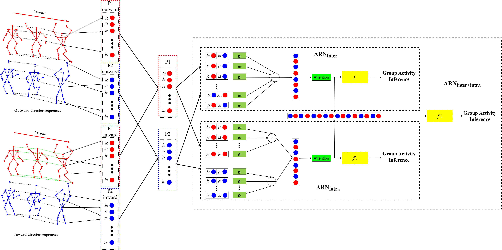

# Attention Relational Network
Code used at paper "Attention Relational Network for Skeleton-based Group Activity Recognition".

See section below for modifications to ARN for Hockey Penalty Dataset and UT-interaction dataset.

It contains an implementation of our Attention Relational Network (ARN), an end-to-end NN tailored for Skeleton-based Group Activity Recognition. 

    

We will make improvement for the ARN,codes will come soon until it success.
